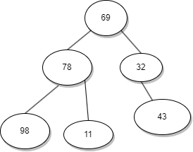

# Trees

Non-Linear, Heirarichal Data Structure.

- Node: Entity to
- Root: Node on the top of the tree. From where all the other nodes originate.
- Children:
- Parent
- Ancestor
- Siblings: Nodes whose parents are same or common parent.
- Descendant
- Leaf

